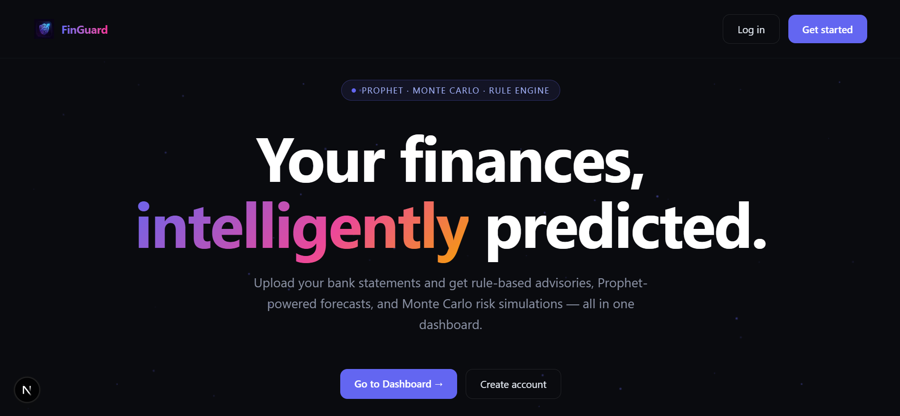
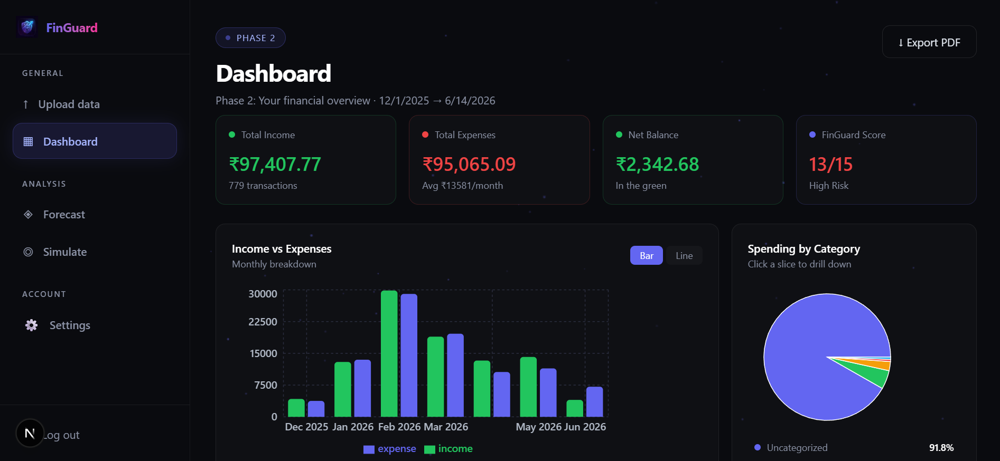
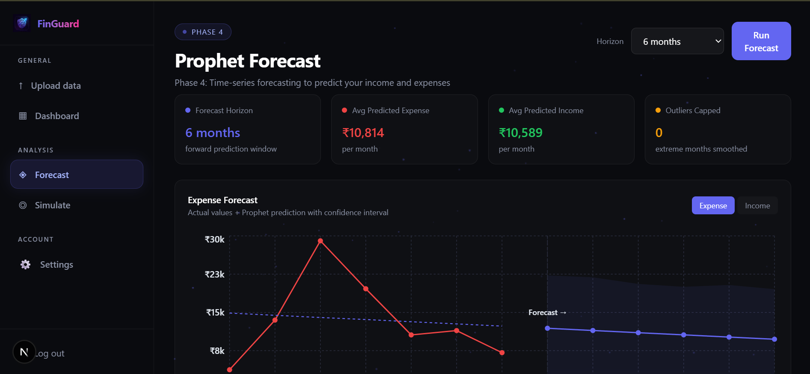
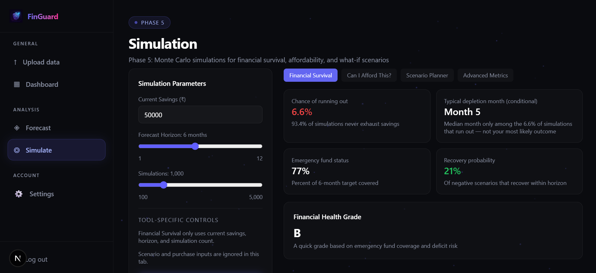
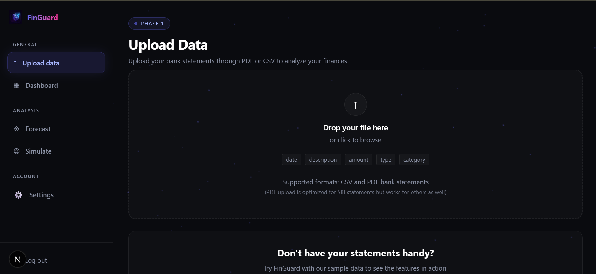

# FinGuard 💰

> Your bank statement knows more about you than you do.


FinGuard turns raw bank transaction history into a full financial intelligence dashboard — spending clusters, personalised advice, 6-month forecasts, and what-if simulations. Upload a CSV or PDF, and it does the rest.

---

## Video Demo

> Will be added soon!

---



---

## The Problem

Most finance apps make you manually categorise transactions, set budgets, and track everything yourself. FinGuard does it automatically — upload 3–12 months of transactions and the ML pipeline handles categorisation, pattern detection, forecasting, and scenario modelling without any manual input.

---

## How It Works

```
Upload CSV / PDF
      ↓
Parse + Clean  →  date, description, amount, type
      ↓
K-Means Clustering  →  Automatic spending categories
      ↓
Rule Engine  →  Personalised budgeting advice
      ↓
Prophet Model  →  3–6 month financial forecast
      ↓
Monte Carlo Simulation  →  What-if scenario modelling
```

> Income is derived directly from transaction data — no manual input required.
> Models are trained on your own data, not generic external datasets.

---

## Pages

### Dashboard

Spending breakdown via ML clustering — see where your money actually goes.



### Forecast

3–6 month financial projection using Facebook Prophet.



### What-If Simulation

Model financial decisions before making them — Monte Carlo simulation across thousands of scenarios.



### Upload

CSV or PDF — both supported. Public sector banks like SBI that only export PDFs are handled automatically via text extraction.



---

## Features

**CSV + PDF Upload** — Direct CSV import or automatic PDF extraction. Supports private sector banks, international banks, and public sector banks like SBI that only provide PDF statements.

**ML Spending Clusters** — K-Means clustering automatically categorises transactions without manual tagging.

**Rule-Based Advisory** — Spending patterns analysed against budgeting rules to surface actionable advice.

**Prophet Forecast** — Facebook Prophet models your next 3–6 months based on historical transaction data.

**Monte Carlo Simulation** — Run thousands of scenarios to understand how financial decisions play out under uncertainty.

---

## File Format

FinGuard expects four fields from your transaction file:

| Field         | Description                   |
| ------------- | ----------------------------- |
| `date`        | Transaction date              |
| `description` | Merchant or transaction label |
| `amount`      | Transaction value             |
| `type`        | Credit or Debit               |

---

## Tech Stack

| Layer             | Tool                          |
| ----------------- | ----------------------------- |
| Frontend          | Next.js, Tailwind CSS         |
| ML / Forecasting  | Prophet, K-Means, Monte Carlo |
| AI                | Gemini API                    |
| PDF Parsing       | pdf-parse                     |
| Report Generation | LaTeX                         |
| Database          | PostgreSQL + Prisma           |

---

## Local Setup

```bash
git clone https://github.com/BlazeGaming456/FinGuard
cd finguard

# Frontend
npm install
cp .env.example .env
npm run dev

# ML API
cd ml
uvicorn forecast_api:app --reload
```

---

## Commit Convention

| Prefix     | When to use                         |
| ---------- | ----------------------------------- |
| `feat`     | New feature                         |
| `fix`      | Bug fix                             |
| `docs`     | Documentation only                  |
| `style`    | Formatting, no logic change         |
| `refactor` | Code restructure, no feature or fix |
| `test`     | Adding or fixing tests              |

Example: `fix(api): resolve null pointer exception in user profile`